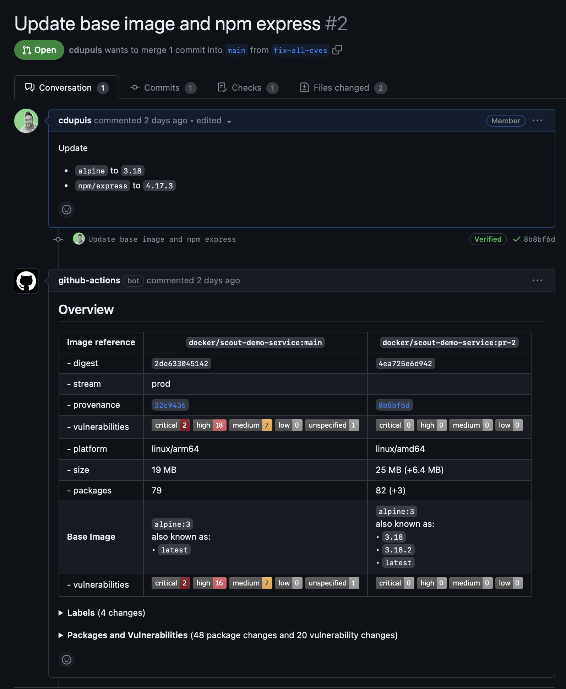

_Note:_ Docker Scout is a new product and is free while in early access. Read more about [Docker Scout](https://www.docker.com/products/docker-scout?utm_source=hub&utm_content=scout-action-readme).

# About

GitHub Action to run the Docker Scout CLI as part of your workflows.

You can pick one of the following command to run:

- `quickview`: get a quick overview of an image, base image and available recommendations
- `compare`: compare an image to a second one (for instance to `latest`)
- `sbom`: generate the SBOM of the image
- `stream`: record an image to a stream



# Inputs

## Command

You can run one or multiple commands in the same GitHub Action run. Use a comma separated list to run several commands.

| <!-- -->             | <!-- -->                                                                  |
|:---------------------|:--------------------------------------------------------------------------|
| `compare`            | Single command to run or comma separated list of commands to run in order |

The commands will be run in the order of the value, and will share the same parameters.

For instance, if you built an image and want to display a `quickview` as well as to `compare` it against the latest indexed one, set the action as following:

```yaml
command: quickview,compare
image: ${{ steps.meta.outputs.tags }}
to-latest: true
```

## Authentication

### Login to Docker Hub

To use `scout` features you need to be authenticated against Docker Hub.

You can use the parameters below to authenticate, or you can use the [`docker/login-action`](https://github.com/docker/login-action). 

| <!-- -->    | <!-- -->                   |
|:---------------------|:---------------------------|
| `dockerhub-user`     | Docker Hub user id         |
| `dockerhub-password` | Docker Hub password or PAT |


### Login to a registry to pull private images (non Docker Hub)


| <!-- -->            | <!-- -->                                             |
|:--------------------|:-----------------------------------------------------|
| `registry-user`     | **required** Registry user id to pull images         |
| `registry-password` | **required** Registry password or PAT to pull images |


## Common Inputs (Image)

| <!-- -->  | <!-- -->                                                           |
|:----------|:-------------------------------------------------------------------|
| `image`   | Name of the image, directory or archive to operate on |
| `platform` | Platform of the image to analyze (or the current platform)         |
| `type` | Type of the image to operate on (`image`, `oci-dir`, `archive` |
| `ref` | Reference to use if the provided tarball containers multiple images, only with `type=archive` |

If `image` is not set (or empty) the most recently built image, if any, will be used instead.

## Step Summary

By default the Markdown output of the command (if supported) will be displayed as a [Job Summary](https://github.blog/2022-05-09-supercharging-github-actions-with-job-summaries/).
This can be disabled if needed.

| <!-- -->  | <!-- -->                                        |
|:----------|:------------------------------------------------|
| `summary` | **default: true** Display output as Job Summary |

## Pull Request Comments

When triggered by a `pull_request` event, the output of the scout command can be written as a comment.

This behaviour is **enabled** by default.

By default one single comment per job step will be kept and updated at each run.
If you prefer to keep previous comments but hide them, set the `keep-previous-comments` parameter to `true`.

`pull-requests: write` permission is required to allow the GitHub action to create the comment.

| <!-- -->                 | <!-- -->                                                                                       |
|:-------------------------|:-----------------------------------------------------------------------------------------------|
| `github-token`           | GitHub Token to create the comment. `github.token` by default                                  |
| `write-comment`          | Boolean, write a comment with scout output. `true` by default                                  |
| `keep-previous-comments` | If set, keep but hide previous comment. If not set, keep and update one single comment per job |

## `compare` Inputs

### Compare to an image

| <!-- -->  | <!-- -->                                                                                         |
|:----------|:-------------------------------------------------------------------------------------------------|
| `to`      | **required** Name of the image, directory or archive to compare with                             |
| `to-type` | Type of the image to compare with (`image`, `oci-dir`, `archive`                                 |
| `to-ref`  | Reference to use if the provided tarball containers multiple images, only with `to-type=archive` |


### Compare to a stream

| <!-- -->    | <!-- -->                           |
|:------------|:-----------------------------------|
| `to-stream` | Name of the stream to compare with |
| `to-latest` | Compare to latest indexed image    |

One or the other needs to be defined.


### Common Inputs

| <!-- -->             | <!-- -->                                                                                                  |
|:---------------------|:----------------------------------------------------------------------------------------------------------|
| `ignore-unchanged`   | Filter out unchanged packages                                                                             |
| `only-severities`    | Comma separated list of severities (`critical`, `high`, `medium`, `low`, `unspecified`) to filter CVEs by |
| `only-package-types` | Comma separated list of package types (like `apk`, `deb`, `rpm`, `npm`, `pypi`, `golang`, etc)            |
| `only-fixed`         | Filter to fixable CVEs                                                                                    |
| `only-unfixed`       | Filter to unfixed CVEs                                                                                    |
| `exit-code`          | Return exit code `2` if vulnerability changes are detected                                                |

## `stream` Inputs

To record an image to a stream, some constraints are applied on top of the above common inputs:

- `type` needs to be `image` (or not set)
- `image` needs to include the digest, so in the form `[registry/]{namespace}/{repository}@sha256:{digest}`

| <!-- -->    | <!-- -->                                    |
|:------------|:--------------------------------------------|
| `to-stream` | Name of the stream to record the image      |
| `to-latest` | Record to latest indexed stream             |
| `to-app`    | Name of the application to record the image |

Either `to-stream` or `to-latest` needs to be set.

## Example usage

```yaml
name: Docker

on:
  push:
    tags: [ "*" ]
    branches:
      - 'main'
  pull_request:
    branches: [ "**" ]
    
env:
  # Use docker.io for Docker Hub if empty
  REGISTRY: docker.io
  IMAGE_NAME: ${{ github.repository }}
  SHA: ${{ github.event.pull_request.head.sha || github.event.after }}

jobs:
  build:

    runs-on: ubuntu-latest
    permissions:
      contents: read
      packages: write
      pull-request: write

    steps:
      - name: Checkout repository
        uses: actions/checkout@v3
        with:
          ref: ${{ env.SHA }}
          
      - name: Setup Docker buildx
        uses: docker/setup-buildx-action@v2.5.0
        with:
          driver-opts: |
            image=moby/buildkit:v0.10.6

      # Login against a Docker registry except on PR
      # https://github.com/docker/login-action
      - name: Log into registry ${{ env.REGISTRY }}
        uses: docker/login-action@v2.1.0
        with:
          registry: ${{ env.REGISTRY }}
          username: ${{ secrets.DOCKER_USER }}
          password: ${{ secrets.DOCKER_PAT }}

      # Extract metadata (tags, labels) for Docker
      # https://github.com/docker/metadata-action
      - name: Extract Docker metadata
        id: meta
        uses: docker/metadata-action@v4.4.0
        with:
          images: ${{ env.REGISTRY }}/${{ env.IMAGE_NAME }}
          labels: |
            org.opencontainers.image.revision=${{ env.SHA }}
          tags: |
            type=edge,branch=$repo.default_branch
            type=semver,pattern=v{{version}}
            type=sha,prefix=,suffix=,format=short
      
      # Build and push Docker image with Buildx (don't push on PR)
      # https://github.com/docker/build-push-action
      - name: Build and push Docker image
        id: build-and-push
        uses: docker/build-push-action@v4.0.0
        with:
          context: .
          push: true
          tags: ${{ steps.meta.outputs.tags }}
          labels: ${{ steps.meta.outputs.labels }}
          cache-from: type=gha
          cache-to: type=gha,mode=max
      
      - name: Docker Scout
        id: docker-scout
        if: ${{ github.event_name == 'pull_request' }}
        uses: docker/scout-action@dd36f5b0295baffa006aa6623371f226cc03e506
        with:
          command: compare
          image: ${{ steps.meta.outputs.tags }}
          to: ${{ env.REGISTRY }}/${{ env.IMAGE_NAME }}:edge
          ignore-unchanged: true
          only-severities: critical,high
          write-comment: true
          github-token: ${{ secrets.GITHUB_TOKEN }} # to be able to write the comment
```  

# License

The Docker Scout CLI is licensed under the Terms and Conditions of the [Docker Subscription Service Agreement](https://www.docker.com/legal/docker-subscription-service-agreement/).
